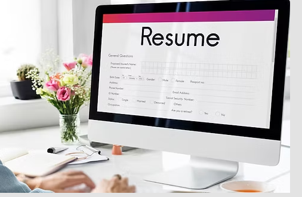
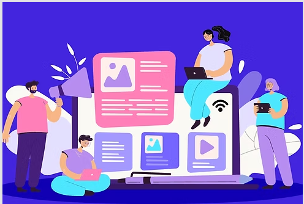

# Asive Khenqa

**Home | About | Projects | Skills | Contact**

---

## Hi, I’m Asive Khenqa
**IT Support Specialist | Certificate in Marketing Management (N4 & N5) | Emerging AI Innovator**

Aspiring ICT Technician and IT Support Specialist passionate about solving tech challenges, blending hands-on troubleshooting skills with strong analytical and communication expertise.

---

### 🔹 View My Projects
Explore a range of projects showcasing my technical expertise, creativity, and growing AI integration.  
[View Projects](#projects)

### 🔹 Learn More About Me
Read about my professional background, certifications, and career journey.  
[About Me](#about)

### 🔹 Download Resume
Access my full professional resume for more details on my experience and skills.  
[Download Resume](https://your-resume-link.com)

---

## About
I am an aspiring ICT Technician and IT Support professional with hands-on experience in desktop troubleshooting, software installation, hardware maintenance, and end-user support. I completed a Technical Support Learnership and an ICT Technician trainee program, where I developed practical skills in installing operating systems, updating software, and resolving technical issues in educational environments.

With a Grade 12 background in Mathematics, Physical Sciences, and Life Sciences and a Certificate in Marketing Management (N4 & N5), I combine strong analytical thinking with effective communication and business skills. I am passionate about technology, problem-solving, and providing reliable IT support, and I aim to continuously grow my expertise in the ICT field.

---

## Education

###  Jongilanga Senior Secondary School — Matric, 2018
Focused on subjects including Mathematics, Physical Sciences, and Life Sciences, building a strong analytical and technical foundation.

###  Russell Road Campus, Port Elizabeth College — Certificate in Marketing Management (N4 & N5), 2021
Gained valuable knowledge in business, communication, and management—enhancing both technical and interpersonal skills.

---

## Projects

###  AI Resume Builder
**Description:** A web app that generates smart, professional resumes using AI.  
**Links:** [Live Demo](https://your-demo-link.com) | [GitHub Code](https://github.com/Asive-khenqa/ai-resume-builder)

###  Custom Content Generator
**Description:** Creates personalized content like bios, blogs, and product descriptions.  
**Links:** [Live Demo](https://your-demo-link.com) | [GitHub Code](https://github.com/Asive-khenqa/custom-content-generator)

###  End-to-End AI Solution
**Description:** Integrates AI model training with full-stack web deployment.  
**Links:** [Live Demo](#) | [GitHub Code](https://github.com/Asive-khenqa/end-to-end-ai-solution)

---

## Skills
**Technical Skills:**  
- IT Support & Troubleshooting  
- Desktop & Hardware Maintenance  
- Software Installation & Updates  
- Windows OS & Microsoft Office  

**AI & Development Skills:**  
- Python (Beginner)  
- OpenAI API Integration  
- React, TypeScript, Tailwind CSS  

**Soft Skills:**  
- Communication & Team Collaboration  
- Analytical Thinking  
- Problem-Solving  

---

## Contact
📧 **Email:** [asivekhenqa@gmail.com](mailto:asivekhenqa@gmail.com)  
🐱 **GitHub:** [github.com/Asive-khenqa](https://github.com/Asive-khenqa)  
📍 **Location:** Port Elizabeth, South Africa  

---

**Created with dedication and continuous learning by Asive Khenqa.**
